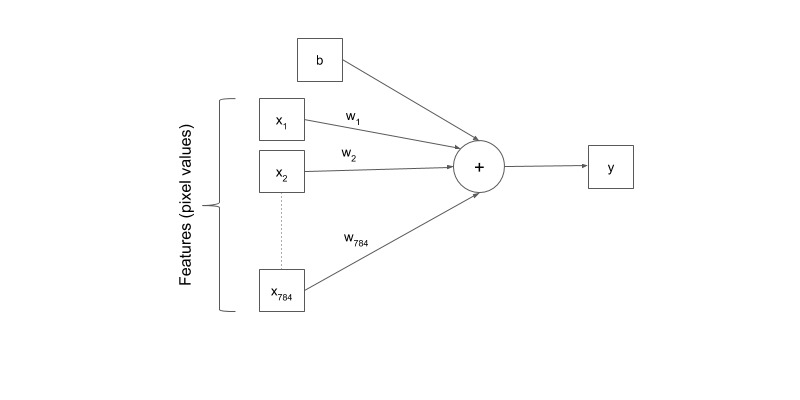

# Image-Classification
Created, trained, and evaluated a Neural Network model that will be able to predict digits from hand-written images with a high degree of accuracy using Tensorflow and MNIST dataset
Here is an illustration that can help you understand how convolutional neural networks work :

